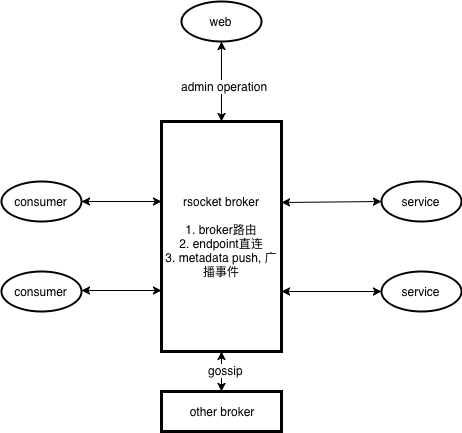

# **kin-rsocket-broker**

Kin RSocket Broker是一款基于RSocket协议的反应式对等通讯系统, 为通讯多方构建分布式的RPC, Pub/Sub, Streaming等通讯支持.

* 反应式: 无需担心线程模型、全异步化、流式背压支持、独特的对等通讯模式可适应各种内部网络环境和跨云混云的需求.
* 消息：面向消息通讯, 服务路由、过滤、observability都非常简单.
* 交换系统：得益于RSocket, 支持完全分布式和异构系统整合简单, 无论应用什么语言开发、部署在哪里, 都可以相互通讯.

## RSocket Broker工作原理

RSocket Broker桥接应用间通讯的双方, 相当于一个中间人的角色. 应用在启动后, 会和Broker创建一个长连接. 如果应用是服务提供者, 会向Broker注册自己能提供的服务信息.
Broker会存储所有应用与其暴露的服务的路由信息. 当一个应用需要调用其他服务时, 应用会将请求以消息的方式发给Broker, 然后Broker会解析消息的元信息, 然后根据路由表将请求转发给服务提供者,
然后将处理结果后的消息再转发给调用方. Broker完全是异步化的, 你不需要关心线程池这些概念, 而且消息转发都是基于Zero Copy, 所以性能非常高.



通过上述的架构图, RSocket Broker彻底解决了传统设计中众多的问题：

* 配置推送: 应用与Broker维持长连接, 只需要Broker通过RSocket的metadataPush就可以完成配置推送
* 服务注册和发现：应用和Broker建立连接后, 应用会通知Broker暴露的服务
* 透明路由: 应用在调用服务时, 不需要知道服务对应的应用信息, 由Broker成路由
* service-to-service调用: RSocket提供的4个模型可以很好地解决服务到服务调用的各种复杂需求
* load balancing: 负载均衡在broker路由过程完成, 对应用完全透明
* circuit breakers: 断路保护, 现在调整为Back Pressure支持, 更贴近实际业务场景
* distributed messaging: RSocket本身就是基于消息推送的, 而且是分布式的.
* 多语言支持: RSocket是一套标准协议, 主流语言的SDK都有支持.

### **实现细节**
* gsv: group!service:version serviceId: hash(gsv)
* handleId: hash(service.handler)
* 目前服务方法参数除了request channel外, 仅仅支持一个message, 主要受限于部分序列化方法, 没法反序列化Object[], 比如protobuf和avro
* 目前`RSocket#fireAndForget(Payload)`不会返回异常给service reference, 如果想知道执行是否有异常, 则需要在service端查看

## **实现模块**

* **kin-rsocket-auth**: 权限校验模块
  * **kin-rsocket-auth-api**: 权限校验接口api模块
  * **kin-rsocket-auth-jwt-starter**: jwt权限校验实现
* **kin-rsocket-bom**: kin rsocket依赖统一管理
* **kin-rsocket-broker**: rsocket broker基础功能实现
* **kin-rsocket-broker-gossip-starter**: gossip broker实现, 整合spring cloud
* **kin-rsocket-broker-standalone-starter**: standalone broker实现, 整合spring cloud
* **kin-rsocket-cloud-function-starter**: rsocket service兼容spring cloud function实现
* **kin-rsocket-conf**: rsocket service配置中心模块
  * **kin-rsocket-conf-api**: : rsocket service配置中心接口api模块
  * **kin-rsocket-conf-h2-starter**: 基于h2文件系统实现的配置中心
  * **kin-rsocket-conf-memory-starter**: 基于内存实现的配置中心
  * **kin-rsocket-conf-server-starter**: rsocket service配置中心实现, 以broker作为桥梁, 为同一broker集群下的app提供配置中心服务
* **kin-rsocket-core**: rsocket核心功能, 实现一些共用的基础功能类
* **kin-rsocket-example**: rsocket示例
  * **kin-rsocket-example-api**: rsocket broker示例api
  * **kin-rsocket-example-broker**: rsocket broker示例
  * **kin-rsocket-example-requester**: rsocket consumer示例
  * **kin-rsocket-example-responder**: rsocket service示例
  * **kin-rsocket-example-springcloud**: rsocket service整合spring cloud示例
  * **kin-rsocket-example-conf-server-service**: rsocket conf server service示例
* **kin-rsocket-gateway-http-starter**: rsocket service http gateway
* **kin-rsocket-registry-client-starter**: 以kin-rsocket-broker作为服务注册中心, 基于spring cloud discovery发现规则, 开发服务
* **kin-rsocket-service**: rsocket服务实现
* **kin-rsocket-service-conf-client-starter**: rsocket service conf client
* **kin-rsocket-service-starter**: rsocket服务实现, 整合spring cloud
* **kin-spring-rsocket-support-starter**: 对spring rsocket进行增强

## **RSocket服务示例**

基于maven

### **Broker单点**

配置pom.xml

```xml

<dependency>
  <groupId>org.kin</groupId>
  <artifactId>kin-rsocket-broker-standalone-starter</artifactId>
</dependency>
```

配置application.yml

```yaml
server:
  port: 9998

kin:
  rsocket:
    broker:
      port: 9999
```

创建main class

```java

@SpringBootApplication
@EnableRSocketBroker
public class RSocketBrokerApplication {
  public static void main(String[] args) {
    SpringApplication.run(RSocketBrokerApplication.class, args);
  }
}
```

### **Broker集群**

目前实现基于gossip管理所有broker  
配置pom.xml

```xml
<dependency>
  <groupId>org.kin</groupId>
  <artifactId>kin-rsocket-broker-gossip-starter</artifactId>
</dependency>
```

配置application.yml

```yaml
server:
  port: 9998

kin:
  rsocket:
    broker:
      port: 9999
      gossip:
        port: 10999
        seeds: ${other broker node host:port}
```

### **RSocket服务提供者**

配置pom.xml

```xml

<dependency>
  <groupId>org.kin</groupId>
  <artifactId>kin-rsocket-service-starter</artifactId>
</dependency>
```

配置application.yml

```yaml
server:
  port: 9100

kin:
  rsocket:
    brokers: tcp://127.0.0.1:9999
    port: 9101
```

创建接口以及其实现类

```java
public interface HelloService {
  Mono<String> hello();
}

@RSocketService(HelloService.class)
@Service
public class HelloServiceImpl implements HelloService {
  @Override
  public Mono<String> hello() {
    return Mono.just("Welcome To RSocket Service");
  }
}
```

创建main class

```java

@EnableRSocketService
@SpringBootApplication
public class ServiceApplication {
  public static void main(String[] args) throws InterruptedException {
    SpringApplication.run(ServiceApplication.class, args);
  }
}
```

另外, 还支持使用`@Bean`+`@RSocketService`创建RSocket服务提供者

```java

@Configuration
public class ResponderConfiguration {
  @Bean
  @RSocketService(UserService.class)
  public UserService userService() {
    return new UserServiceImpl();
  }
}
```

### **RSocket服务消费者**

配置pom.xml

```xml

<dependency>
  <groupId>org.kin</groupId>
  <artifactId>kin-rsocket-service-starter</artifactId>
</dependency>
```

配置application.yml

```yaml
server:
  port: 9200

kin:
  rsocket:
    brokers: tcp://127.0.0.1:9999
    port: 9201
```

创建服务引用

```java
@Configuration
public class RequesterConfiguration {
  @Bean
  public UserService userService(@Autowired RSocketServiceRequester requester) {
    return RSocketServiceReferenceBuilder
            .requester(UserService.class)
            .upstreamClusterManager(requester)
            .build();
  }
}
```

创建main class

```java

@EnableRSocketServiceReference
@SpringBootApplication
public class RequesterSpringApplication {
  public static void main(String[] args) {
    SpringApplication.run(RequesterSpringApplication.class, args);
  }
}
```

目前支持以下三种方式构建rsocket service reference

* 使用`@Bean`+`RSocketServiceReferenceBuilder`构建rsocket service reference

```java

@Configuration
public class RequesterConfiguration {
  @Bean
  public UserService userService(@Autowired RSocketServiceRequester requester) {
    return RSocketServiceReferenceBuilder
            .requester(UserService.class)
            .upstreamClusterManager(requester)
            .build();
  }
}
```

* 使用`@Bean`+`@RSocketServiceReference`构建rsocket service reference

```java

@Configuration
public class RequesterConfiguration {
  @Bean
  @RSocketServiceReference(interfaceClass = UserService.class)
  public RSocketServiceReferenceFactoryBean<UserService> userService() {
    return new RSocketServiceReferenceFactoryBean<>();
  }
}
```

* 使用`@RSocketServiceReference`注解在字段变量上构建rsocket service reference

```java

@RestController
public class UserController {
  @RSocketServiceReference
  private UserService userService;
}
```

## **整合Spring Cloud**

基于playtika的reactive feign提供支持异步的feign

rsocket broker相当于注册中心, 每个消费者挂上 ```kin-rsocket-registry-client-starter``` 发现broker上已注册的服务,
每个rsocket服务都需要挂上 ```kin-rsocket-gateway-http-starter```, 那么就可以实现类似于spring cloud全家桶那样子的 微服务架构. 当然, 对于异构集群,
可以把 ```kin-rsocket-registry-client-starter``` 和 ```kin-rsocket-gateway-http-starter```
同时作为两个集群的一员, 然后通过registry client发现broker服务, 根据服务实例信息, 请求gateway, 进而实现非对称集群访问rsocket broker集群服务

详细代码请看 ```kin-rsocket-example-springcloud``` 模块

## **展望**

## References
* Alibaba RSocket Broker: https://github.com/alibaba/alibaba-rsocket-broker
* RSocket Service Registry: https://github.com/alibaba-rsocket-broker/rsocket-load-balance